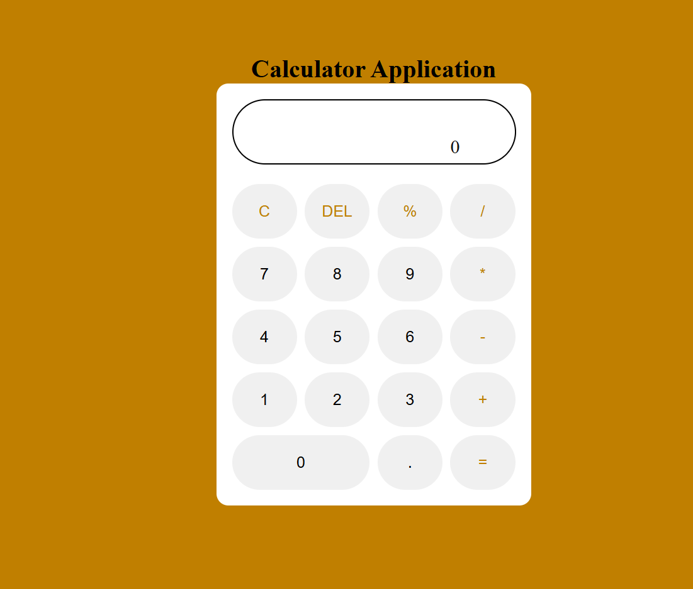

**Description**
Simple Calculator app created with React.js
This pull request introduces a new React Calculator application. The app allows users to perform basic arithmetic operations, including addition, subtraction, multiplication, and division. The calculator also supports additional functionalities such as:

Clear the current input
Toggle negative values
Calculate percentages
Handle decimal points
Display results of calculations

**Changes Made**
Created Calculator Component: Added a Calculator component that handles the calculator's functionality and user interface.
Redux Integration: Integrated Redux to manage the state of the calculator's expression and answer.
Added mathjs Library: Utilized the mathjs library for evaluating mathematical expressions.
Styled Components: Applied basic styling for the calculator using CSS classes.
Updated Dependencies: Added mathjs, react-redux, and other necessary dependencies to the project.

**Files Added/Modified**
***src/components/Calculator.js*:** New component for the calculator's UI and logic.
***src/redux/actions.js:*** Redux actions for updating the calculator's state.
***src/redux/reducer.js:*** Redux reducer for managing the state of expressions and answers.
***src/App.js:*** Updated to include the new Calculator component.
***src/App.css:*** Added basic styles for the calculator.
***package.json:*** Updated dependencies.

# Live Demo
https://dycodes.github.io/calculator-reactjs/

## Demo 📸

**npm start**
Runs the app in the development mode.
Open http://localhost:3000 to view it in the browser.

**How to test**
1. clone the Repository:
git clone <repository-url>
cd <repository-directory>

2. Install Dependencies:
npm install

3. Start the Development Server:
npm start

4. Verify Functionality:
Open the application in your browser.
Test various calculator operations (addition, subtraction, multiplication, division).
Ensure that the clear, negative toggle, and percentage functionalities work as expected.

**npm run build**
Builds the app for production to the build folder.
It correctly bundles React in production mode and optimizes the build for the best performance.

**npm run eject**
Note: this is a one-way operation. Once you eject, you can’t go back!

If you aren’t satisfied with the build tool and configuration choices, you can eject at any time. This command will remove the single build dependency from your project.

Learn More
You can learn more in the Create React App documentation.

To learn React, check out the React documentation.